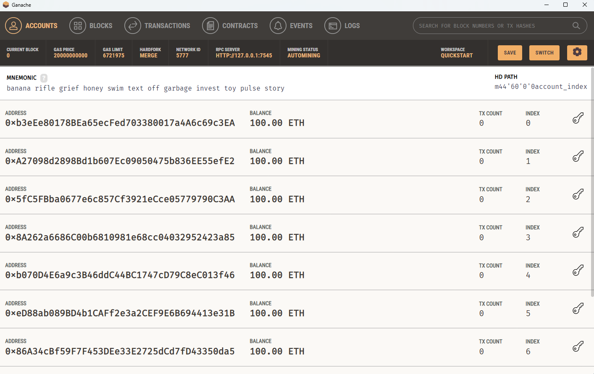
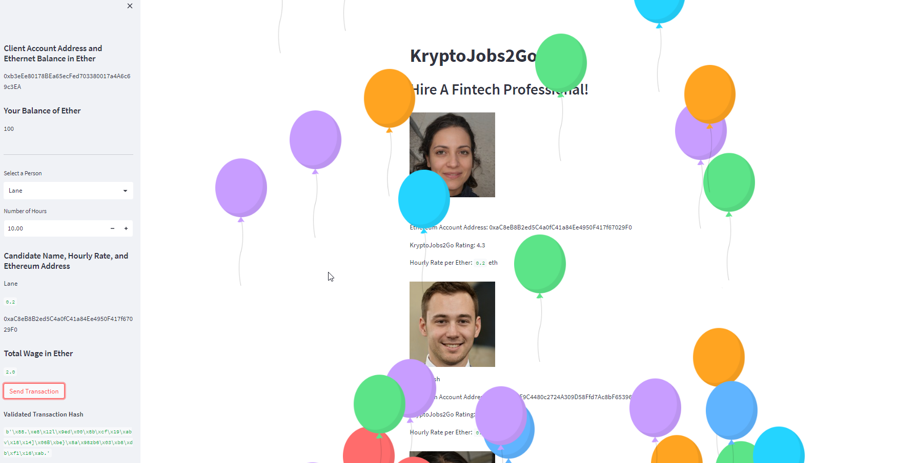
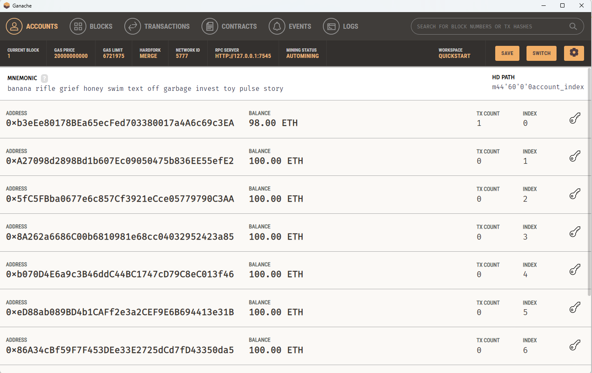
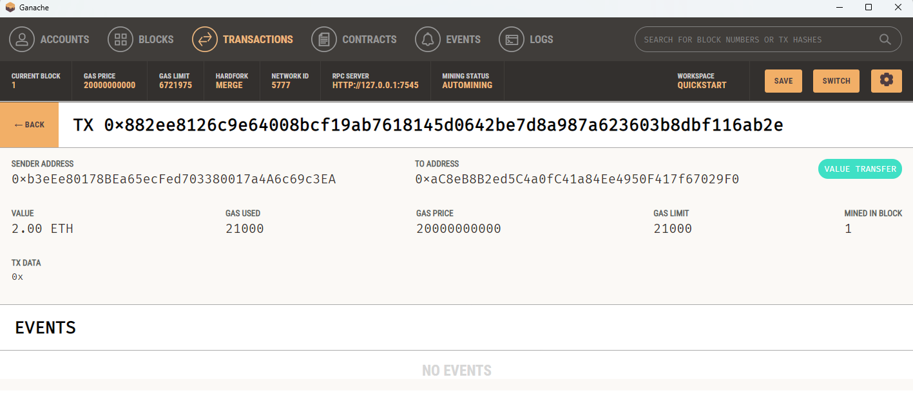

## Unit 19 Homework: Cryptocurrency Wallet

## Please check for python code in master branch  it is not in main branch.

### Important Note

## check master branch for code. not the main branch.

1. From your terminal, navigate to the project folder that contains your `.env` file and the `krypto_jobs.py` and `crypto_wallet.py` files. Be sure to activate your Conda `dev` environment if it is not already active.

2. To launch the Streamlit application, type `streamlit run krypto_jobs.py`.

3. On the resulting webpage, select a candidate that you would like to hire from the appropriate drop-down menu. Then, enter the number of hours that you would like to hire them for. (Remember, you do not have a lot of ether in your account, so you cannot hire them for long!)

4. Click the Send Transaction button to sign and send the transaction with your Ethereum account information. Navigate to the Transactions section of Ganache.

    * Take a screenshot of your address balance and history on Ganache. Save this screenshot to the README.md file of your GitHub repository for this Challenge assignment.

    * Take a screenshot of the transaction details on Ganache. Save this screenshot to the README.md file of your GitHub repository for this Challenge assignment.

5. Return to the original transaction, and click the transaction’s To address.

* Take a screenshot of the recipient’s address balance and history from your Ganache application. Save this screenshot to the README.md file of your GitHub repository for this Challenge assignment.

---

## Submission

* Upload the files for this assignment to your GitHub repository.

  * Done

* Submit the link to your GitHub repo on Bootcamp Spot.

  * Done

  

---

## Screen Shots

* Take a screenshot of your address balance and history on Ganache. Save this screenshot to the README.md file of your GitHub repository for this Challenge assignment.

* Take a screenshot of the transaction details on Ganache. Save this screenshot to the README.md file of your GitHub repository for this Challenge assignment.

